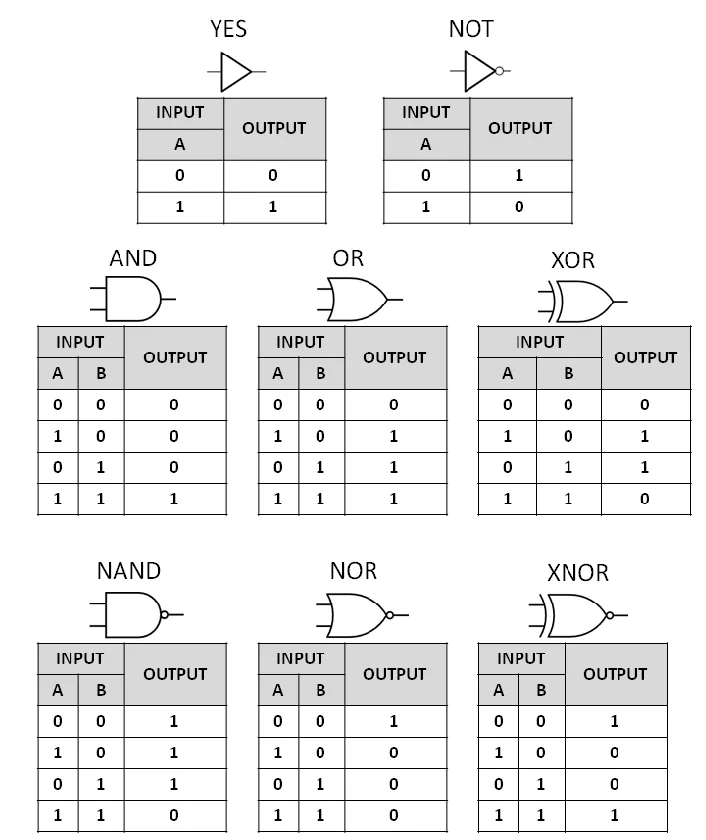

# Introduction

A broad definition: "In a general way, we can define computing to mean any goal-oriented activity requiring, benefiting from, or creating computers."

More Formal: "Type of arithmetic or non-arithmetic calculation that is well-defined."

- Computers have become ubiquitous (can find them everywhere).
- Varied usage: Social media, ChatGPT, weather forecast, computer-aided design etc.
- A lot of compute happens on the 'Cloud' (Not your computer but that of GAFAM mostly).

## History
Modern computing started with a desire for a precise language for philosophical questions.

- May have heard of Turing (Imitation Game) but might not have heard of Godel.
- Punching card machines.
- Basic electronics with limited functionality.
- General purpose computers.
- Artificial Intelligence (AI) is the newest frontier.
- But there are theoretical limits! Uncomputable problems exist.

# Practical computers

It takes two for a tango. Need both **Hardware** and **Software**. Hardware involves actual physical machines which perform the operations that are involved in computing. Software just specifies what is to be done which is then handled by the hardware. In software, we define a set of actions that are performed for a desired result.

- Abacus with beads and stones.
- Mechanical: Pascaline (Pascal), Difference Engine (Babbage).
- Electronic: From Vacuum tubes to transistors.

# Modern day computers: Behind the scenes

Behind the scenes, the modern computers use transistors whose voltage has two levels. On/Off, 1/0, True/False. Called Boolean honouring George Boole. Information in computers is represented using building blocks called bits. These can take only two values zero or one. The basic idea is to put a lots of bits together to represent everything (a bit exaggerated). What can we represent using bits?

- Human speech, human language, animal sounds, assignment submissions.
- Concepts in human thought using AI.
- Images, Videos.
- and a lot more.

# The mathematics behind

We start with the decimal numbers we know well. You might see on your apps something like this:
```
likes = 3456
```
What does this mean. You have three thousand, four hundred, fifty, and six likes.
```
likes = 3x1000 + 4x100 + 5x10 + 6
```
We are so used to the decimal system that we do not think of them composed in this manner. This will change when dealing with computers because it only deals with ones and zeros. We don't have the numbers 2 to 9.

The decimal system is actually a **Base** 10 system this means that we represent using ten symbols and powers of ten. Going back:

$likes = 3\times 10^3 + 4\times 10^2 + 5\times 10^1 + 6\times 10^0$

If we use only two symbols it is called binary system, if eight it is called Octal (Latin inspired?), and if sixteen it is called Hexadecimal (six plus ten basically).

### Example: Binary System

$$students = 264 \newline
students = 256 + 8 \newline
students = 1\times 2^8 + 0\times 2^7 + 0\times 2^6+ 0\times 2^5 + 0\times 2^4 + 1\times 2^3 + 0\times 2^2 + 0\times 2^1 + 0\times 2^0 \newline
students = (100001000)_2
$$

### Example: Octal System

Consider the octal number:

$$
(753)_8
$$

Its positional decomposition is:

$$
(753)_8 = 7 \times 8^2 + 5 \times 8^1 + 3 \times 8^0
$$

$$
= 7 \times 64 + 5 \times 8 + 3 \times 1
$$

$$
= 448 + 40 + 3
$$

$$
= 491_{10}
$$

Therefore,

$$
(753)_8 = (491)_{10}
$$

### Example: Hexadecimal System

Consider the hexadecimal number:

$$
(3A5)_{16}
$$

Here, the hexadecimal digit \(A\) represents the decimal value \(10\).
$$
(3A5)_{16} = 3 \times 16^2 + 10 \times 16^1 + 5 \times 16^0
$$
$$
= 3 \times 256 + 10 \times 16 + 5 \times 1
$$
$$
= 768 + 160 + 5
$$
$$
= 933_{10}
$$

Therefore,

$$
(3A5)_{16} = (933)_{10}
$$

### Question
Can we have a base 1 system? How will it look? Remember prisoners counting days in films.

## How do computers do this math?
Since computers only can understand bits they have to perform math using operations on bits. This is accomplished using basic logic gates and binary logic.



We have already seen that in the binary system we put together bits in a sequence to represent numbers. 

- We have *short*, *int* and *long* integers depending on the number of bits they contain. Traditionally,
- *short* has 16 bits
- *int* has 32 bits
- *long* has 64 bits

### We have only seen binary logic operations on bits but how do we do the usual math like addition, subtraction, multiplication, and division?

The answer is that we have to use a combination of binary logic operations. For binary addition without carry we use **XOR** operation and for just getting the carry term we use **AND**. See below example,

```
15 ->         1 1 1 1
10 ->         1 0 1 0
carry ->    1 1 1 - -
------------------------------
25 ->       1 1 0 0 1
```


# References
https://cs.calvin.edu/activities/books/processing/text/01computing.pdf

[Binary numbers and addition](https://web.math.princeton.edu/math_alive/1/Lab1.shtml)

https://www3.ntu.edu.sg/home/ehchua/programming/java/datarepresentation.html
