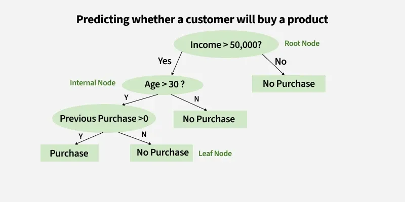

# Age-Based Discount Using `if-else-if`

Write a **C program** that asks the user to enter their age and displays their **age category** and the **discount percentage** they are eligible for.

## Age Categories

| Age | Category | Discount |
|---|---|---:|
| 60 and above | Senior Citizen | 20% |
| 25–59 | Adult | 10% |
| 13–24 | Young Adult | 20% |
| Below 13 | Child | 30% |

## Requirements

Your program should:

1. Ask the user to enter their age.
2. Use an **`if-else-if` chain** to determine their age category.
3. Display the category and discount percentage.
4. If the user enters a negative age, display **`Invalid age`**.

## Explanation

An **`if-else-if` chain** is used when we have multiple conditions to check.

The program checks the conditions one by one:

- If the age is **60 or above**, the person is a **Senior Citizen** and gets a **20% discount**.
- Otherwise, if the age is **25 or above**, the person is an **Adult** and gets a **10% discount**.
- Otherwise, if the age is **13 or above**, the person is a **Young Adult** and gets a **20% discount**.
- Otherwise, the person is a **Child** and gets the **highest discount of 30%**.
- If the age is negative, the age is considered **invalid**.

> **Important:** In an `if-else-if` chain, conditions are checked from top to bottom. Once a condition is true, the remaining conditions are skipped.

# Decision tree to C code

A company wants to predict whether a customer will **buy a product** based on:

- **Income**
- **Age**
- **Previous Purchase**

Convert the given decision tree into a **C program using `if-else` statements**.

## Decision Tree Rules

- If `Income > 50,000`
  - If `Age > 30`
    - If `Previous Purchase > 0` → **Purchase**
    - Otherwise → **No Purchase**
  - Otherwise → **No Purchase**
- Otherwise → **No Purchase**

## Instructions

When converting a decision tree into C:

- A **question/condition** becomes an `if` statement.
- The **Yes** branch becomes the code inside `if`.
- The **No** branch becomes an `else`.
- A **leaf node** becomes the output using `printf()`.
- Start from the **root node** and follow the tree downward.

# E-Commerce Discount Calculator

Write a **C program** for an e-commerce website that calculates the discount for a customer based on their **purchase amount** and **membership status**.

The program should ask the user to enter:

1. The total purchase amount.
2. Whether they are a member (`1` for Yes, `0` for No).

## Discount Rules

| Purchase Amount | Member | Discount |
|---:|:---:|---:|
| ₹5000 or more | Yes | 25% |
| ₹5000 or more | No | 20% |
| ₹3000–₹4999 | Yes | 20% |
| ₹3000–₹4999 | No | 15% |
| ₹1000–₹2999 | Yes | 15% |
| ₹1000–₹2999 | No | 10% |
| Below ₹1000 | Yes | 5% |
| Below ₹1000 | No | 0% |

## Requirements

Your program should:

- Use an **`if-else-if` chain** to check the purchase amount.
- Inside each purchase amount category, use a **nested `if-else`** to check membership.
- Calculate and display the discount amount and final amount.
- Display **`Invalid purchase amount`** if the amount is negative.

## Explanation

The program makes decisions at **two levels**.

First, the outer `if-else-if` determines which **purchase amount category** the customer belongs to.

Then, inside each category, a nested `if-else` checks whether the customer is a **member**.

# E-Commerce Order Feasibility

An e-commerce company uses different order-processing rules based on the **total order value**.

Write a C program that determines whether an order is **feasible** according to the configuration that applies to it.

The program should accept the following inputs:

- **Order value** in rupees
- **Number of items** in the order
- **Total weight** of the order in kilograms

## Configurations

### Standard Order

If the order value is **less than ₹5000**, the order is classified as a **Standard Order**.

A Standard Order is feasible only if:

- The number of items is at least **2**.
- The number of items is at most **8**.
- The total weight is at most **15 kg**.

### Premium Order

If the order value is **₹5000 or more**, the order is classified as a **Premium Order**.

A Premium Order is feasible only if:

- The number of items is at least **1**.
- The number of items is at most **12**.
- The total weight is at most **25 kg**.

## Requirements

The program should:

1. Read the order value, number of items, and total weight.
2. Determine whether the order is a Standard or Premium Order using the **₹5000 threshold**.
3. Check the constraints corresponding to the selected configuration.
4. Use a variable named `feasible` to store the result.
5. Use **nested `if-else` statements** to check the constraints.
6. Display the selected configuration and whether the order is **Feasible** or **Not Feasible**.

